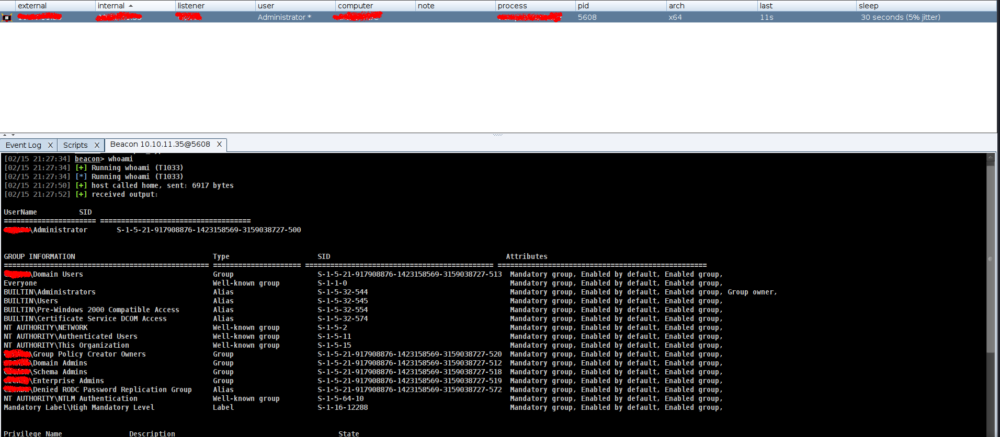

# fodhelper_bypassBOFS
Cobalt Strike UAC bypass bofs

## USAGE
```
➜  fodhelper_bypassBOFS git:(main) ✗ cat reverse-shell.ps1 | iconv -t UTF-16LE | base64 -w0
```
and modify C code.

Upload CNA Cobalt Strike -> Script Manager
and run
```
beacon> fodhelper_bypass
```
enjoy with ur new beacon

